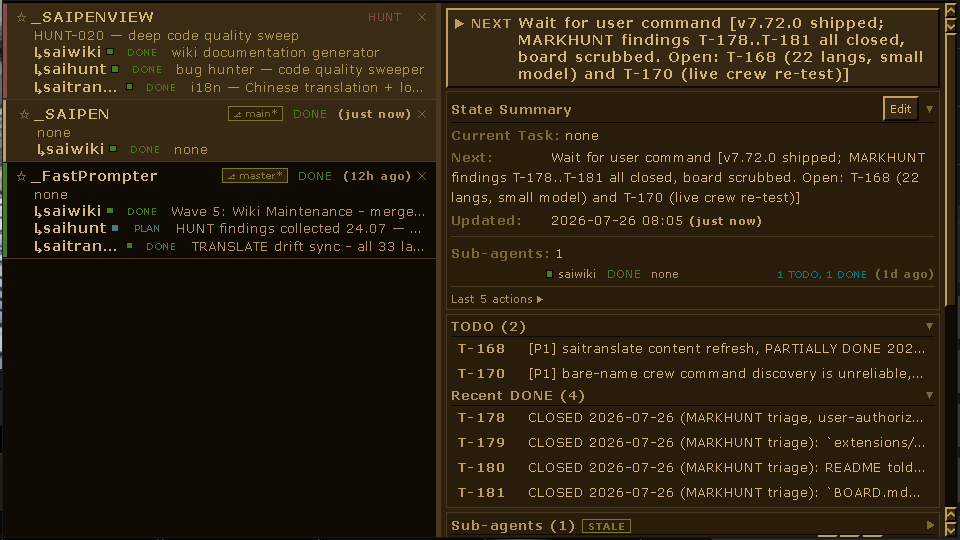
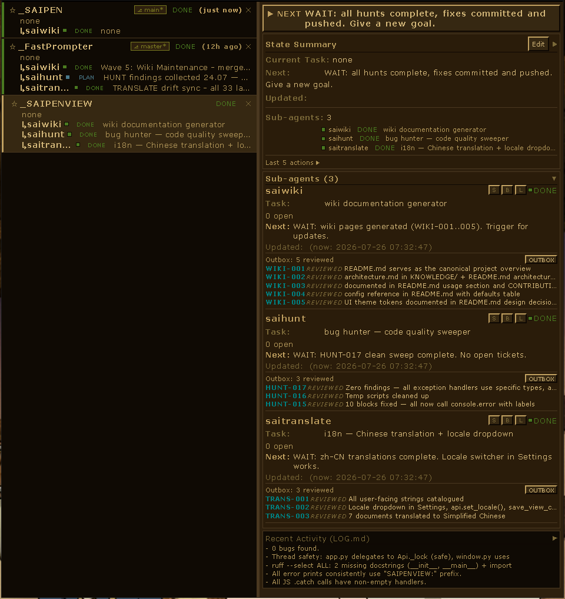

<div align="right">
  🌍 <a href="../../README.md">EN</a> | <a href="README.ar.md">AR</a> | <strong>BG</strong> | <a href="README.cs.md">CS</a> | <a href="README.da.md">DA</a> | <a href="README.de.md">DE</a> | <a href="README.ee.md">EE</a> | <a href="README.el.md">EL</a> | <a href="README.es.md">ES</a> | <a href="README.fi.md">FI</a> | <a href="README.fr.md">FR</a> | <a href="README.he.md">HE</a> | <a href="README.hi.md">HI</a> | <a href="README.hr.md">HR</a> | <a href="README.hu.md">HU</a> | <a href="README.id.md">ID</a> | <a href="README.it.md">IT</a> | <a href="README.ja.md">JA</a> | <a href="README.ko.md">KO</a> | <a href="README.nl.md">NL</a> | <a href="README.no.md">NO</a> | <a href="README.pl.md">PL</a> | <a href="README.pt.md">PT</a> | <a href="README.ro.md">RO</a> | <a href="README.ru.md">RU</a> | <a href="README.sk.md">SK</a> | <a href="README.sv.md">SV</a> | <a href="README.th.md">TH</a> | <a href="README.tr.md">TR</a> | <a href="README.uk.md">UK</a> | <a href="README.vi.md">VI</a> | <a href="README.zh.md">ZH</a> | <a href="README.zh-CN.md">ZH-CN</a> | <a href="README.ded.md">ДЕД</a>
</div>

<div align="center">
  
  <h1 align="center">SAIPENVIEW</h1>
  <p align="center">
    <strong>Десктоп трей инструмент за преглед на всеки SAIPEN проект на вашата машина</strong>
    <br>
    Автоматично открива <code>.saipen/</code> проекти в локалните дискове — текуща фаза, задача, блокировка, git статус, тикети и под-агенти.
    <br>
    Едно табло в ретро тъмно-златист стил Win95.
  </p>
  <p>
    <a href="https://www.python.org/downloads/"></a>
    <a href="../../LICENSE"></a>
    <a href="https://github.com/vacterro/saipenview"></a>
    <a href="https://github.com/vacterro/saipenview/releases"></a>
    <a href="https://github.com/vacterro/saipenview/actions"></a>
    [🤍 Подкрепете разработчика](https://buymeacoffee.com/vacuum34)
  </p>
</div>

<br>

---

<br>

## ✨ Накратко

<p align="center">
  
  <br>
  <em>Всеки SAIPEN проект, под-агент, тикет и git статус — всички в един изглед.</em>
</p>

<br>

---

## 🚀 Възможности

<table>
<tr>
<td width="50%">

### 🔍 Откриване
- **Авто-сканиране** на локални дискове за `.saipen/` проекти
- **Потребителски корени** — избор на папки или цели дискове
- **Умно изключване** — `node_modules`, `.git`, системни директории
- **Сканиране във фонов режим** — конфигурируем интервал (по подразбиране 300с)
- **Свързани worktree-та** — открива git worktree-та за лесна настройка

### 📊 Табло
- **Фаза**, **задача**, **следващо действие**, **блокировка** на живо
- **Git клон** + индикатор за незапазени промени за всеки проект
- **Филтриране** по фаза (Всички / Активни / Завършени / Блокирани / потребителски)
- **Сортиране** — Умно, Скорошни, Най-стари, А–Я, Я–А
- **Търсене** — филтър по име/корен + дълбоко търсене в тикети
- **Закачане** на проекти отгоре, **скриване** на нерелевантни
- **Примигващо подчертаване** — променените проекти светват и избледняват за 20с
- **Топлинно оцветяване** — остарелите проекти се охлаждат, новите се затоплят

</td>
<td width="50%">

### 🧩 Под-Агенти
- **Вложени изгледи** — `saiwiki`, `saihunt`, `saitranslate` са с отстъп под родителя
- **Броячи на изходяща кутия** — готови/блокирани/чернови/прегледани с един поглед
- **Събиране с един клик** — сгъване на готовите записи в главния проект
- **Предупреждение за остаряване** — открива остарели протоколни файлове

- **Agent Engine** - стартиране на `claude-code` (или други двигатели: codex, aider, gemini, cline, goose, agy, generic_cli) в проект
  - **Жив статус** - състояние на работа/изход, CPU, изминало време на проект
  - **Конзола за изход** - буфериран изход на агента (по подразбиране 5000 реда), вход в stdin
  - **Kill / stop all** - спиране на процес и глобален стоп
  - **Защита от дублиране** - само един екземпляр; втори старт показва прозореца
### 🎮 Взаимодействие
- **Преглед на файлове** — четене и редактиране на STATE.md, BOARD.md, LOG.md
  - Режим изходен код (редактируем) + Режим за четене (рендериран)
- **Интерактивни тикети** — бутоните Start / Done обновяват BOARD.md на живо
- **Бързи действия** — контекстни `npm run dev`, `cargo test` и т.н.
- **Потребителски команди** — бутони за действия, дефинирани от потребителя
- **Сгъваеми секции** — за всеки проект, със запазване
- **Преоразмеряема странична лента** — плъзнете за преоразмеряване

### ⌨️ Бързи клавиши и Прозорец
- **Показване/Скриване** — `Ctrl+Alt+X` (конфигурируемо)
- **Залепване в ъгли** - `Alt+F14` превключва TL → TR → BL → BR
- **Мащабиране** — `Ctrl+КолелоНаМишката`, `Ctrl+`+`/`-`
- **Системен трей** — минимизиране в трея, стартиране скрит
- **Винаги най-отгоре** превключвател
- **Автостарт** — незадължително стартиране с Windows
- **Режим без рамка** — изключване на заглавната лента за ултра-минималистичен изглед

</td>
</tr>
</table>

<br>

---

<br>

## 🎯 Бърз старт

<table>
<tr>
<th width="33%">🐍 Стартиране от изходен код</th>
<th width="33%">📜 Скриптове за стартиране</th>
<th width="33%">📦 Инсталация (бъдеще)</th>
</tr>
<tr>
<td>

```bash
git clone https://github.com/vacterro/saipenview.git
cd saipenview
python -m venv .venv
.venv\Scripts\python -m pip install -r requirements.txt
.venv\Scripts\python -m saipenview
```

</td>
<td>

| Скрипт | Поведение |
|---|---|
| `run.vbs` | Скрит (само трей), тих |
| `run.bat` | Стартиране в трей; конзолата се вижда само при еднократна настройка на venv/зависимостите |
И двата автоматично създават `.venv` и инсталират зависимости.

</td>
<td>

```bash
pip install saipenview
saipenview
```
Очаквайте скоро ✨

</td>
</tr>
</table>

<br>

---

## ⌨️ Употреба

| Действие | Как |
|---|---|
| **Показване / Скриване** | `Ctrl+Alt+X` или `Alt+F15` (и двете са конфигурируеми) |
| **Залепване в ъгъл** | `Alt+F14` - превключва Горе-Ляво → Горе-Дясно → Долу-Ляво → Долу-Дясно |
| **Аварийно спиране** | `Ctrl+Shift+Alt+Q` — принудително прекратяване на процеса |
| **Увеличаване / Намаляване** | `Ctrl+КолелоНаМишката` или `Ctrl` + `+` / `-` |
| **Нулиране на мащаба** | `Ctrl+0` |
| **Превключване на лентата с инструменти** | `Alt+D` — сгъване/разгъване на панела с инструменти |
| **Търсене на проекти** | Въведете в полето за търсене; маркирайте `D` за дълбоко търсене в тикети |
| **Филтриране** | Падащо меню: Всички / Активни / Завършени / Блокирани, или кликнете върху значка за фаза |
| **Сортиране** | Умно / Скорошни / Най-стари / А–Я / Я–А |
| **Повторно сканиране** | Кликнете `Rescan` или изчакайте фоновия таймер (по подразбиране 300с) |
| **Преглед на папка** | Кликнете `Browse` за добавяне на папка към набора за сканиране |
| **Настройки** | Бутонът ⚙ отваря модалния прозорец за настройки |
| **Помощна уики страница** | Бутонът `?` отваря вграденото мини-уики |
| **Десен клик върху проект** | Копиране на коренния път, филтриране по фаза, отваряне на папка |
| **Двойно кликване върху секция** | Отваря свързания файл (STATE.md, BOARD.md, LOG.md) |
| **Плъзгане на прозорец** | Плъзнете заглавната лента (или навсякъде в режим без рамка) |

### Модални прозорци

| Модален прозорец | Какво прави |
|---|---|
| **Настройки** | Мащаб, бързи клавиши, настройка на сканирането, автостарт, винаги най-отгоре, шрифт, примигване, режим по подразбиране на прегледника, потребителски команди, локал, корени за сканиране |
| **Преглед на файлове** | Четене и редактиране на STATE.md, BOARD.md, LOG.md — режим Изходен код (суров) или Режим за четене (рендериран) |
| **Помощ** | Изчерпателно мини-уики, покриващо всяка функция, бърз клавиш и концепция |
| **Потвърждение** | Ретро DOM диалог (заменя native `confirm()`) |

<br>

---

## 🧬 Протокол SAIPEN

SAIPENVIEW е компаньон за проекти, използващи **Протокола SAIPEN** — рамка от краен автомат, която води AI агенти през работата по проекта в определени фази:

```
INIT → PLAN → SCOUT → BUILD → REVIEW → VERIFY → SHIP → DONE
                 ↓              ↓
            HUNT / CLEAN    VALIDATE
```

`ADD`, `MARKHUNT`, `TRANSLATE`, `PREPARE` също съществуват - пълният речник и таблицата за преходи са в `saipenview/protocol.py` (`BLOCKED` е достижим от повечето фази).
Всеки SAIPEN проект съхранява състоянието си в три канонични файла:

| Файл | Назначение |
|---|---|
| `.saipen/STATE.md` | Машинно-читаем frontmatter — фаза, задача, следващо действие, блокировка |
| `.saipen/BOARD.md` | Табло с тикети — секции DOING / TODO / DONE / BLOCKED |
| `.saipen/LOG.md` | Хронологичен дневник на събитията — всяка команда и нейният резултат |

**Под-агентите SubSaipen** (`saiwiki`, `saihunt`, `saitranslate`) се намират в `.saipen/extensions/subs/` и комуникират чрез `kitchen/OUTBOX.md` — вградената в протокола шина за съобщения между агенти. SAIPENVIEW открива всички тях и рендерира обединено табло.

### Съответствие

Показването на това какво *казва* един проект е само половината от работата. Един проект може да изглежда перфектно в списъка — фаза, задача, следващо действие — докато се намира в състояние, което протоколът отхвърля, и докато не стартирате `tools/validate.py` ръчно, нямаше начин да ги разграничите.

Всеки ред носи значка с вердикт, а панелът с подробности изброява какво не е наред:

| Вердикт | Значение |
|---|---|
| `OK` | Нищо нередно не е намерено във собствените `.saipen/` файлове на този проект |
| `N WARNS` | Валидно, но с отклонения — остарял чекпойнт, нестандартен LOG глагол |
| `N FAILS` | Състояние, което протоколът отхвърля: `WAIT:` без категория, чекбокс, който не съвпада със секцията си, `needs:`, сочещ към несъществуващ тикет, UTF-16 `STATE.md`, който никой друг SAIPEN инструмент не може да прочете |

Всяко findings посочва правилото, файла, реда и клаузата, от която произлиза, така че да може да се провери, а не да се приема на доверие.

Това е **второ мнение, а не заместител** на `tools/validate.py`. То проверява повторно само това, което собствените файлове на даден проект могат да решат, и го оценява спрямо копие от речниците на протокола — така че версията на SAIPEN, от която е прочетено, се отпечатва под всеки вердикт. Прегледникът има право да изостава от протокола. Няма право да изостава мълчаливо.

> 💡 *Името "SAIPENVIEW" казва всичко — осигурява **изглед (view)** към всеки **SAIPEN** проект на вашата машина.*

<br>

---

## ⚙️ Настройка

Конфигурацията е преносима — съхранява се до приложението, а не в `%APPDATA%`:

```
saipenview/_data/config.json
```

Основни стойности по подразбиране (съкратено - пълният речник `DEFAULTS` е в `saipenview/config.py`):

```json
{
  "hotkeys":          ["ctrl+alt+x", "alt+f15"],
  "snap_hotkey":      ["alt+f14"],
  "zoom_level":       1.0,
  "font_family":      "Verdana_m1",
  "scan_roots":       null,
  "rescan_interval":  300,
  "scan_depth":       6,
  "scan_delay_ms":    10,
  "exclude_dirs":     [],
  "auto_scan":        true,
  "show_on_launch":   true,
  "always_on_top":    true,
  "frameless":        true,
  "flash_changes":    true,
  "locale":           "en",
  "default_engine":   "claude-code",
  "file_viewer_default": "source",
  "layout_swap":      false
}
```

Задайте `scan_roots: null` за автоматично откриване на всички локални дискове.  
Задайте списък с пътища (напр. `["V:\\", "D:\\projects"]`) за ограничаване на сканирането.  
`default_engine` / `engine_overrides` / `agent_output_buffer_size` управляват Agent Engine (виж Функции).  
Всички настройки са конфигурируеми и през модалния прозорец **Настройки** в приложението.

<br>

---

## 🏗️ Архитектура

```
saipenview/
├── app.py              Входно свързване - трей, горещ клавиш, прозорец, api, защита от дублиране
├── api.py              JS мост към pywebview (66 публични метода)
├── scanner.py          Обхождане на дискове + цикъл за фоново повторно сканиране
├── parser.py           Парсиране на STATE.md / BOARD.md / LOG.md
├── textio.py           Един четци за всеки .saipen/ файл — BOM, UTF-16, cp1251
├── protocol.py         Затворени речници на протокола + BASELINE_VERSION
├── conformance.py      Оценява проект спрямо тези речници
├── config.py           Зареждане/запазване на настройки (атомни записи)
├── tray.py             Икона в системния трей pystray + меню
├── hotkey.py           Глобална регистрация на бързи клавиши (библиотека keyboard)
├── autostart.py        Управление на автостарт в Windows Registry
├── zone_picker.py      Оверлей за залепване в ъгъл Alt+F14 (tkinter)
├── events.py           Вътрешнопроцесна шина за събития (EventBus)
├── guard.py            Заключване на един екземпляр + предаване на показване
├── git_diff.py         Diff / commit / revert на работното дърво за действия на агенти
├── runtime.py          Agent Engine - мениджър на процеси за стартирани агенти
├── watcher.py          Watchdog наблюдател на .saipen/ файлове
├── engines/            Agent Engine - поддържани CLI двигатели (claude-code, codex,
│                       aider, gemini, cline, goose, agy, generic_cli)
├── ui/
│   ├── window.py       pywebview прозорец — показване/скриване/превключване/прилепване
│   └── static/
│       ├── index.html
│       ├── style.css   Ретро тъмно-златиста тема Win95
│       └── app.js      Логика на фронтенда (~3300 реда)
├── assets/
│   └── tray_icon.png
├── screenshots/        Екранни снимки за README
└── _data/              Конфигурация по време на работа + кеш (в .gitignore)
```

### Принципи на дизайна

- **Единствен процес** — без фонов IPC, без отделен сървър; един Python процес хоства както WebView2 прозореца, така и цикъла за сканиране в `ThreadPoolExecutor`
- **Атомни записи** — всеки запис във файл използва временен файл + `os.replace`; срив никога не може да съкрати конфигурацията или кеша
- **Защитен от остарели данни** — 5-секундното анкетиране на UI извиква `refresh_known()` (препрочита само `.saipen/` файлове, без обхождане на директории). Редакциите в STATE.md се появяват за секунди, без да предизвикват пълно сканиране на диска
- **Без CSS преходи** — всички визуални ефекти (примигване, топлина, посочване) са преизчисления чрез JavaScript `hexBlend`, стриктно спазвайки ограничението за липса на анимации на ретро темата
- **Ретро тема** — тъмнокафяви повърхности, златист текст/акценти, 3D релефни рамки, без заглаждане (anti-aliasing), шрифт Verdana_m1

<br>

---

## 🧪 Разработка

```bash
# Клониране и влизане
git clone https://github.com/vacterro/saipenview.git
cd saipenview

# Създаване на venv и инсталиране
python -m venv .venv
.venv\Scripts\activate
pip install -r requirements.txt

# Стартиране
python -m saipenview
```

За подробна настройка, конвенции за писане на код и работен поток за PR вижте [CONTRIBUTING.md](../../CONTRIBUTING.md).

### Изисквания

- **Windows 10 / 11** — WebView2 среда (предварително инсталирана в Win11, авто-инсталира се в Win10)
- **Python 3.10+**
- Зависимости: `pystray`, `keyboard`, `pywebview`, `Pillow`, `watchdog`, `psutil`

<br>

---

## 📄 Лиценз

MIT — вижте [LICENSE](../../LICENSE).

<br>

---

<div align="center">
  <sub>Създадено с 🐍 Python • 🖼️ pywebview • 🎨 Ретро Win95 естетика</sub>

<br>

---

## 📸 Още екранни снимки

<p align="center">
  
  <br>
  <em>Панел с подробности с тикети, под-агенти и преглед на файлове.</em>
</p>

<br>

</div>
